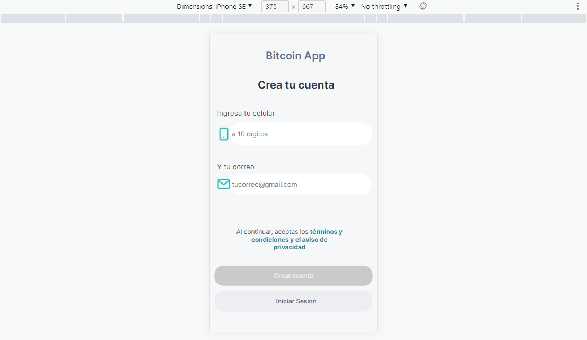

## SOBRE EL PROYECTO

Resolucion de prueba, aplicacion web con lo requerimientos especificados hecha con ReactJS y estilizada con CSS puro

### Sobre el proyecto
***
Se implemento proteccion de rutas, actions de manera muy superficial para el logeo en el localStorage, y formulario validado con JavaScript

### FUNCIONAMIENTO

